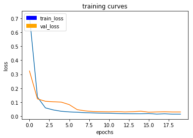
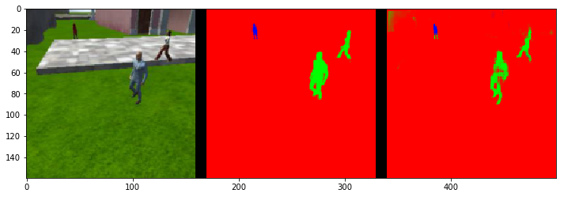

# Project: Follow Me

## [Write-up Rubric Points](https://review.udacity.com/#!/rubrics/1155/view)
1. Provide a write-up / README document including all rubric items addressed in a clear and concise manner. The document can be submitted either in either Markdown or a PDF format.
2. The write-up conveys the an understanding of the network architecture.
3. The write-up conveys the student's understanding of the parameters chosen for the the neural network.
4. The student has a clear understanding and is able to identify the use of various techniques and concepts in network layers indicated by the write-up.
5. The student has a clear understanding of image manipulation in the context of the project indicated by the write-up.
6. The student displays a solid understanding of the limitations to the neural network with the given data chosen for various follow-me scenarios which are conveyed in the write-up.

## Architecture

In summary, our model is mainly made of 2 encoder blocks and 2 decoder blocks with a 1x1 convolutional layer in-between. The model output layer is another 1x1 convoluational layer which contains the semantic segmentation result.


### 1. Encoder Layer(s)

The goal of the encoder is to extract features from the image. The encoder consists of 1 or more encoder blocks. Each encoder block consists of the following in sequence:
1. Separable Conv layer.
2. Batch Normalization layer.

The encoder portion of the FCN is just a convolutional network that reduces to a deeper 1x1 Conv layer, in contrast to a flat fully connected layer that would be used for basic classification.

The first encoder block is the one with the highest resolution of all the encoder blocks and is the one that extracts the lowest level of features from the image, while the last encoder block is the lowest resolution of all the encoder blocks and is the one that extracts the highest level of features from the image.

We used 2 encoder blocks after trial and error. The 1st encoder increases the input depth to 80x80x64 while the 2nd encoder to 40x40x256. The number of encoder blocks is an important FCN design decision that will be discussed in the hyperparameters section next.

#### 1.1 Separable Convolutional Layer

The goal of the first layer of the encoder block is to capture the input features, which is done by downsampling the input (i.e. reducing its width and height say from H x W to H/2 x W/2) while increasing its depth from D to N. One common way to achieve this is using N regular **Strided Convolution** filters with stride of 2, this will result in N feature maps each of size H/2 x W/2, the result is an output of dimension H/2 x W/2 x N.

There is another way to achieve the same goal but with less parameters, and that's the _Seperable Convolutions_ a.k.a _Depthwise Separable Convolutions_. We use D (3x3) convolutions with stride of 2, each to traverse a certain channel which results in D feature maps each of size H/2 x W/2. Next, traverse those D features maps with each of the D 1x1 convolutions, the result is an output of dimension H/2 x W/2 x N.

**Example:**
Take the first encoder block in our model for example. It has input of 160x160x3, and the desired output depth is 64, we also want to half the width and height, thus using stride of 2.
- In case of regular convolutions, we would require 3x3x3x64 = 1728 parameter.
- In case of separable convolutions, we would require (3x3x3)+(3x64) = 27 + 192 = 219 parameter. That is around 9 times smaller than the number of parameters in regular convoltuions.

The separable convolution layers used across the model all have kernel size 3x3, stride 2 and use the SAME padding.

#### 1.2 Batch Normalization Layer

We used batch normalization after each convolutional layer in our model except in the output layer. It allows each layer of the network to learn by itself a little bit more independently of the other layers. It gives the following advantages:
1. We can safely use higher learning rates because batch normalization makes sure that no activation goes very high or very low.
2. Reduces overfitting due ot its slight regularization effect similar to drop-out. This is because the mean and variance computed for each layer input is based on the current mini-batch during the training phase instead of being computed across the dataset which results in added noise to the hidden layers activations.
3. Deeper layers are less sensitive to change in early layers, which speeds up learning.

It worth noting that the larger the batch size, the smaller the regularization effect. For example, the noise generated when using small batch size like 64 is larger than that when using large batch size like 512. This can explain why small batch sizes used during hyperparameter tuning suffered from less overfitting than when using large ones.

This layer adds 2 learnable parameters, the mean and variance of the input activations.

### 2. 1x1 Convolutional Layer (1x1 Conv)

We used a single 1x1 Conv layer in the middle between the encoders and decoders. This layer has double the depth (256) of the last encoder (128) to have dimensions of 40x40x256. Like all Conv layers in the model, we follow this layer with a Batch Normalization layer which in this case has dimensions of 40x40x256 as well.

What about using fully connected layer instead? See next.

#### 2.1 1x1 Conv VS Fully Connected Layer (FC)

In traditional Convolutional Networks, the FC layer is usually the last layer in the network and hence the output layer. This layer takes an arbitrary input 3-D volume _H x W x D_ and outputs a 1-D vector of size N where N is the number of classes the model has to choose from. Total number of parameters then is _H x W x D x N_.

In FCN, we replace the FC layer with 1x1 Conv layer because FCs don't preserve spatial information which is OK in classification tasks, but for sematic segmentation task the spatial information is very important, the more we preserve along the computation graph, the better our model will be. In this model we use 1x1 Conv as a cheap way to **increase dimensionality** and hence ability to capture more information while **preserving spatial information** while introducing few extra parameters.

The number of outputs in FC is N (number of classes) while the number of kernels in a 1x1 Conv layer will be N which result in N feature maps each of size _H x W_. The number of parameters in 1x1 Conv layer is _D x N_ vs _H x W x D x N_ for FC layer.

### 3. Decoder Layer(s)

The goal of the decoder is to upscale the output of the encoder such that it is the same size as the original image, thus it results in segmentation of each pixel in the original image. The decoder consists of 1 or more decoder blocks and the number of decoder blocks must match the number of encoder blocks. Each decoder block consists of the following in sequence:
1. Bilinear upsampling layer.
2. Concatenation layer for skip connections.
3. Separable Conv layer.
4. Batch Normalization layer.

We used 2 decoder blocks to match the 2 encoder blocks used earlier in the encoder.

#### 3.1 Bilinear Upsampling

The upsampling layer is the 1st layer in the decoder block and is **non-learnable**, so it doesn't introduce any new parameters.

This layer upsamples the output from the previous layer which is necessary during the decoding phase when reconstructing the full resolution of the input image. We used an upsampling window size of 2x2, thus doubling the input height and width while preserving the depth.

**Bilinear Upsampling vs Transposed Convolution**

The other technique to perform upsampling is the transposed convolutions which is a learnable layer unlike the bilinear upsampling layer which is non-learnable. The bilinear upsampling method is more prone to errors but is a cheaper way to increase resolution and hence speeds up performance.

#### 3.2 Layer Concatenation

The concatenation layer is the 2nd layer in the decoder block and is **non-learnable**, so it doesn't introduce any new parameters.

One effect of convolutions or encoding technique in general is that we keep narrowing down our lense and look closely at some features losing the bigger picture as a result. The more encoders we have, the bigger the loss at the end of the encoding phase. Skip connections with element wise addition is a way to reuse features from previous layers with higher resolutions and hence more spatial information.

The technique we used here instead is layer concatenation, in which we concatenate two layers, the upsampled layer and a layer with more spatial information than the upsampled one. The 2 concatenated layers have to have the same height and width, but can differ in depth. The newly concatenated the layer will have the same height and width but a depth equal to the sum of the upsampled and larger layer depth.

I couldn't find out yet when to use layer addition vs concatenation when merging layers to implement skip connections.

 #### 3.3 Separable Conv Layer

 This is the major **learnable** layer of the decoder block. We used ReLU activation function, kernel size of 3x3, stride of 1x1 and SAME padding.

### 4. Output Layer

The output layer is a 1x1 conv layer with 3 filters corresponding to the number of classes, hence the output depth is 3 which result in 3 activation maps, each for one of the classes. This layer differs from the other conv layers in the network in the activation function, where it uses the Softmax for multi-class scoring vs ReLU for the others.

The reason why this layer is not FC, is because we still want to preserve spatial information which is crucial to the semantic segmentation task as mentioned earlier.

## Training

The default dataset provided with the project was used for training. Shortage of time was the biggest reason.

We utilized both the AWS GPU instance and a local PC with GTX 1060 GPU to train more than 1 model at a time, which saved alot of time during hyperparameter tuning. The PC was utilized for training with small batch sizes due to its limited 6GB GPU memory while the larger batch sizes were trained on the AWS GPU instance thanks to the K80 12GB GPU memory.

### Augmentation

Some online research suggest that one can extend and enhance the dataset quality without having to actually collect more data. The technique is called image augmentation, and it simply performs simple image processing techniques to generate new training samples, some of the common augmentation techniques: Scaling, translation, rotation, flipping, change of light condition, perspective transform, add noise.

After some search on Slack, it turned out that augmentation is implemented in the jupyter notebook `data_iterator.py` in `BatchIteratorSimple` util code but that code block was commented out for some reason:

```py
if self.shift_aug:
    image, gt_image = shift_and_pad_augmentation(image, gt_image)
```

Since we had no time to collect a new dataset, we uncommented that block to give the augmentation implementation a try. It actually paid-off and resulted in an increase in final score by not less than 3% as shown next.

## Hyperparameters

The method used for tuning the hyper-parameters was completely manual, a mix between brute force and educated guess in a trial and error fashion.

We experimented with 5 different model architectures, with varying individual layer depth and number of layers. Each of the 5 models is referred to across this document using its ID. **FCN Model IDs:**
- fcn1: enc(32) enc(64) conv1x1(128) dec1(64) dec1(32)
- fcn2: enc(32) enc(64) enc(128) conv1x1(256) dec1(128) dec1(64) dec1(32)
- fcn3: enc(64) enc(128) enc(256) conv1x1(512) dec(256) dec(128) dec(64)
- fcn4: enc(64) enc(128) conv1x1(256) dec1(128) dec1(64)
- fcn5: enc(64) enc(128) conv1x1(256) dec2(128) dec2(64)

Where:
- enc: is encoder block of seperable convolution layer followed by batch normalization layer.
- conv1x1: is 1x1 convolutional layer.
- dec1: is a decoder block of biliniar upsampling, followed by skip connection concatination, followed by 1 single seperable convolution layer.
- dec2: is the same as dec1 except that it has 2 seperable convolution layers at the end instead of 1 as in dec1.

See the Appendix for a graph visualization for each of the 5 FCN models.

FCN4 was the model we settled on at the end since it had the highest final score 0.435.

The table below captures all our hyperparameter tuning experiments. The run_id field is used to identify each combination of parameters including the model used. run_id that starts with `aws` refer to models trained on the AWS GPU instance, while run_id that starts with `pc` refer to models trained on the local PC GPU. The number after either `aws` or `pc` indicate the order in which that run got executed. e.g. `aws16` run happened after `aws15`. Each of `aws` and `pc` has their own sequence.

A run_id that has the asterisk `*` postfix indicate that image augmentation was enabled for that run. You notice that the majority of the runs didn't have augmentation enabled, and that is because we knew about that feature very late.

**run\_id**|**fcn model id**|**learning\_rate**|**batch\_size**|**num\_epochs**|**steps\_per\_epoch**|**validation\_steps**|**final\_score**|**s/epoch**|**loss**|**val\_loss**|**false\_pos**|**false\_neg**|**final\_IoU**
-----|-----|-----|-----|-----|-----|-----|-----|-----|-----|-----|-----|-----|-----
`aws21*`|fcn4|0.0001|32|40|128|64|`0.43`5|92|0.0153|0.0237|0/80/2|0/0/141|0.574
`pc18`*|fcn4|0.001|32|50|128|64|`0.424`|90|0.0155|0.0263|0/77/2|0/0/147|0.563
`aws12`|fcn3|0.005|100|20|100|50|`0.421`|260|94.0000|0.0310|0/57/3|0/0/174|0.569
aws20|fcn4|0.0001|32|40|128|64|0.406|92|0.0160|0.0260|0/72/2|0/0/151|0.563
aws15|fcn3|0.001|64|20|64|32|0.404|107|0.0096|0.0285|0/48/1|0/0/189|0.551
aws16|fcn3|0.001|32|50|128|64|0.403|108|0.0090|0.0305|0/46/1|0/0/189|0.549
pc6|fcn1|0.001|80|20|50|25|0.403|60|0.0202|0.0327|0/111/1|0/0/146|0.553
pc10|fcn4|0.005|40|30|100|50|0.402|86|0.0230|0.0325|0/70/3|0/0/163|0.542
pc7|fcn1|0.001|80|20|100|50|0.400|120|0.0192|0.0288|0/81/2|0/0/154|0.538
pc17*|fcn4|0.005|32|30|128|64|0.398|88|0.0229|0.0349|0/174/5|0/0/134|0.574
pc16*|fcn4|0.001|32|30|128|64|0.398|91|0.0210|0.0280|0/76/4|0/0/162|0.540
aws11|fcn3|0.001|100|10|100|50|0.395|262|0.0194|0.0304|0/67/3|0/0/176|0.541
aws14|fcn3|0.01|80|20|100|50|0.394|210|0.0163|0.0320|0/136/3|0/0/151|0.560
pc13|fcn5|0.001|32|30|128|64|0.392|102|0.0239|0.0309|0/85/2|0/0/158|0.533
aws19|fcn4|0.005|32|30|128|64|0.391|92|0.0205|0.0294|0/93/1|0/0/166|0.541
aws13|fcn3|0.001|100|20|100|50|0.387|267|0.0151|0.0306|0/63/2|0/0/182|0.532
pc5|fcn1|0.001|40|20|200|50|0.369|114|0.0226|0.0315|0/86/1|0/0/161|0.504
aws17|fcn4|0.001|32|30|128|64|0.367|92|0.0253|0.0345|0/64/3|0/0/165|0.493
pc4|fcn1|0.002|40|20|80|20|0.365|45|0.0278|0.0329|0/94/2|0/0/168|0.520
aws4|fcn1|0.001|200|5|200|50|0.362|496|0.0279|0.0359|0/130/4|0/0/155|0.515
pc9|fcn1|0.001|80|30|100|50|0.360|119|0.0274|0.0388|0/91/4|0/0/175|0.506
aws8|fcn3|0.001|100|10|200|50|0.353|262|0.0122|0.0328|0/53/1|0/0/212|0.503
aws18|fcn4|0.001|64|15|128|64|0.353|183|0.0277|0.0385|0/63/2|0/0/181|0.485
aws1|fcn1|0.001|100|10|200|50|0.349|230|0.0300|0.0365|0/101/3|0/0/163|0.487
pc15|fcn4|0.001|32|30|128|64|0.348|89|0.0256|0.0306|0/61/2|0/0/175|0.472
aws7|fcn2|0.001|200|10|100|50|0.340|297|0.0157|0.0318|0/50/2|0/0/224|0.493
pc3|fcn1|0.005|100|15|80|20|0.340|120|0.0324|0.0411|0/117/2|0/0/166|0.483
aws6|fcn2|0.001|100|5|200|50|0.299|272|0.0295|0.0364|0/41/1|0/0/244|0.443
pc11|fcn4|0.001|40|30|100|50|0.299|85|0.0173|0.0295|0/41/1|0/0/244|0.443
pc1|fcn1|0.001|100|15|80|20|0.274|117|0.0357|0.0433|0/84/3|0/0/198|0.396
aws3|fcn1|0.001|200|5|100|50|0.006|269|0.0391|0.0571|0/0/0|255/0/292|0.018
aws2|fcn1|0.001|200|5|20|50|0.000|90|0.4819|0.5099|0/0/0|539/0/301|0.000
aws5|fcn1|0.005|200|10|200|50|0.000|crash| | | | |
aws9|fcn3|0.001|100|10|40|20|0.000|105|0.0329|0.0991|0/0/0|539/0/301|0.000
aws10|fcn3|0.002|100|10|40|20|0.000|106|0.0394|0.1001|0/0/0|539/0/301|0.000
pc8|fcn4|0.001|50|20|100|50|0.000|crash| | | | |
pc2|fcn1|0.01|100|15|80|20|0.000|crash| | | | |

The model file for each run is saved at the directory [./data/weights](./data/weights) in the format `model_weights_<run_id>`

The train/validation loss graph for each run is saved at the directory [./misc](./misc) in the format `plot_run_<run_id>`

Following is the loss vs epoch graphs for the top 3 runs:

- FCN4 with final score 0.435


- FCN4 with final score 0.424


- FCN3 with final score 0.421


### Hyperparameter Choice Reasoning

Here are the hyperparameters we settled on which are for the top performing run `aws21*` on model FCN4:
- Learning Rate: 0.0001
- Batch Size: 32
- Epoch Count: 40
- Steps/Epoch: 128
- Validation Steps: 64

**Model Architecture**

We started with FCN1 and the best we could get with it was a marginal .40 final score for run `pc6`. We thought about increasing the model depth by adding an extra encoder and decoder blocks which resulted in FCN2. We weren't able to cross 0.34 with FCN2 so we expected that increasing the encoder and decoder blocks again won't help. We decided to double the depth of each single layer in FCN1 and FCN2 in case the individual layers needed more parameters to store more information. That resulted in 2 new models namely FCN3 and FCN4 with which we were able many times to come close and marginally cross the .40 final score mark. We focused our efforts on tuning these 2 models till the end.

**Learning Rate**

We started with 0.001 and moved from there up and down. We tried the set {0.01, 0.001, 0.002, 0.005, 0.0001}. We knew from online research that it is a good practice to start with a high learning rate like 0.01 and then gradually reduce it by multiplying by 0.1 as you go.

FCN3 Learning Rate 0.001 (left, `aws13`) vs 0.005 (right, `aws12`)

 

FCN4 Learning Rate 0.001 (left, `pc11`) vs 0.005 (right, `pc10`)

 


**Batch Size**

At the beginning we were tempted to experiment with large batch size thinking that it is always better, and that fitting the whole dataset into a single iteration is the perfect scenario with opposed to mini-batching. We started with batch size of 100 on the PC and then pushed that up to 200 on the AWS GPU. We found that going beyond 100 either overflowed the GPU memory or result in a sub-par performance. The fact that training with > 100 took too much time with no tangible benefit resulted in focusing on 100 and below.

After some online research, we found that using small batch size can be beneficial and most of the time it can converge faster than huge batch sizes. It also turns out that small batch size plays very well with batch normalization as mentioned earlier. We also found that power of 2 batch sizes were common in the community, so we started using that. Batch sizes of 32 and 64 would run with FCN1 and FCN2, but 128 would flow with FCN3 and FCN4.

We tried batch size of 32 and 64 on FCN4 with the same hyperparameters in run `aws17` and `aws18`. We foudn that batch size of 64 resulted in a slightly worse model accuracy than 32 so we focused our tuning on 32 for the reset of the FCN3 and FCN4 trials since 32 it takes less time to train, and yet have a promising accuracy that just needs a little more tuning.

FCN1 Batch Size 40 (left, `pc5`) vs 100 (right, `aws1`):

 

**Epoch Count**

We experimented with the epoch set {5, 10, 15, 20, 30, 40, 50}. We found that large batch size (>= 100) required less epochs (<= 10) for it to converge and the training loss curve to settle, while small batch size (<= 64) required larger number of epochs (>= 15).

**Steps/Epoch and Validation Step Size**

We first experimented with 200 Steps/Epoch and 50 Validation Steps, but then it didn't make sense as it would take too much time with large epochs plus we wouldn't need that much steps to cover the whole dataset.  The provided training dataset is ~4K image, while the validation dataset is ~2K images. Dividing the input size by the batch size made more sense and we sticked with that.

FCN1 Steps/Epoch / Validation Step Size 50/25 (left, `pc6`) 100/50 (right, `pc7`):

 

The final score difference between the 2 runs is negligible, both are ~.40

## Performance

The final score of our model (FCN4) is 0.435, while the final IoU is 0.574.

Following is a sequence of images captured from the notebook Evaluation section.

When following the target closely, the model has an average IoU of 0.9010718598448584 for identifying the target and we have 0 false positive and 0 false negatives which is very good.That means that our model was very good at following target in close range.


When on patrol and the target is not visible, the model has an average IoU of 0.6994969367886311 for identifying other people. Not bad, but the problem is that we have 80/270 false positive, which means that 30% of the time we mistakenly identify a target.


When on patrol and the target is far away, the model has an average IoU of 0.24674559238141824 for identifying the target from distance we have 141/322 false negatives which is pretty bad. This means that our model missed the target 43% of the time which is poor.




**Live Simulation Run**

Below is a screenshot showing the Quadcopter running in simulation and following the target using the `aws21` learnt model (model is saved at as both `./weights/model_weights and `./weights/model_weights_aws21`)


A snippet from the console:

```
2018-04-18 09:16:59.352093: I tensorflow/core/common_runtime/gpu/gpu_device.cc:1030] Creating TensorFlow device (/gpu:0) -> (device: 0, name: GeForce GTX 1060 6GB, pci bus id: 0000:01:00.0)
(23757) wsgi starting up on http://0.0.0.0:4567
(23757) accepted ('127.0.0.1', 36557)
Target found!

```

## Future Enhancements

Few questions needs answering that relates to the model generalization i.e. ability for reuse with different tasks:
1. Will our model trained with the **same provided** dataset work for following another object (e.g. doc, cat, car, etc.) instead of a human?
    - The short answer is no. Using our trained model for following other objects will definitely fail because the dataset used for training was the project provided one, and has human only.
    - We will need to collect a different but proper dataset than the provided one.
1. Will our model trained with a **different but proper** dataset (contains different objects of interest) work for following another object (e.g. doc, cat, car, etc.) instead of a human?
    - We didn't verify that, but if we want to use the model with the same hyper-parameters then the guess is no and there are few reasons for that reasoning:
        - The chosen hyper-parameters are tuned for the this project exact FollowMe task which has the following characteristics:
            - Input image resolution: The provided dataset uses 160x160 RGB image.
            - Detected objects structure: The model knows how to recognize human body structure features, which differs from
            - Number of classes: Our model knows to learn 3 classes only.
    - If we mean by *work* is to exceed the .40 final score mark, then that is unknown for sure. Any change in the task aforementioned characteristics will definitely require retuning the hyper-parameters at least, if not re-considering the model architecture. Using the same hyper-parameters used for training this model but with a different but proper dataset may or may not achieve a good accuracy.

### Hyper-parameters Tuning Technique

We need to be more efficient in tuning the hyper-parameters space. We thought about the typical Grid Search technique for automating the tuning process but after some online research, it turned out to be sometimes inefficient technique specially with complex models and huge datasets. The tuning process is an iterative process, and certain combinations of hyper-parameter values doesn't make sense. It seemed that experience with DNN and knowledge of industry best practices is the key for tuning.

Some recent research has been done on how to automate hyper-parameter tuning, those papers needs to be looked into.

#### Dataset Size and Quality

Highest final score we could achieve was .435 and that was with the project provided dataset which is around 4000 training sample and 2000 validation sample. We spent a lot of time experimenting with different FCN architectures (see FCN1,FCN2,FCN3,FCN4 in Appendix) and manual hyper-parameters tuning but we couldn't achieve better. Collecting a larger and better dataset seems to be another thing to try.

#### Inception

The Inception modules concept was introduced in the lectures, but we didn't have the chance to explore it. It worth trying it and see how much can it improve our model score with using the provided dataset.

## Appendix

**FCNs Keras Visualization**

```py
keras.utils.plot_model(model, to_file=viz_file, show_shapes=True)
```

**FCN1**


**FCN2**


**FCN3**


**FCN4**


## References

- [Batch normalization in Neural Networks
](https://towardsdatascience.com/batch-normalization-in-neural-networks-1ac91516821c)
- [The Effect of Batch Normalization on Deep Convolutional Neural Networks](https://kth.diva-portal.org/smash/get/diva2:955562/FULLTEXT01.pdf)
- [Andrew Ng Batch Normalization explanation video](https://www.youtube.com/watch?v=nUUqwaxLnWs)
- [Encoder-Decoder Networks for Semantic Segmentation](https://courses.cs.washington.edu/courses/cse576/17sp/notes/Sachin_Talk.pdf)
- [Depthwise Separable Convolution](https://www.slideshare.net/DongWonShin4/depthwise-separable-convolution)
- [A Beginner's Guide To Understanding Convolutional Neural Networks Part 2](https://adeshpande3.github.io/A-Beginner%27s-Guide-To-Understanding-Convolutional-Neural-Networks-Part-2/)
- [Batch Normalization: Accelerating Deep Network Training by Reducing Internal Covariate Shift](https://arxiv.org/pdf/1502.03167.pdf)
- [Semantic Segmentation using Fully Convolutional Networks over the years
](https://meetshah1995.github.io/semantic-segmentation/deep-learning/pytorch/visdom/2017/06/01/semantic-segmentation-over-the-years.html#sec_fcn)
- [Understanding Neural Networks Through Deep Visualization](http://yosinski.com/deepvis#toolbox)
